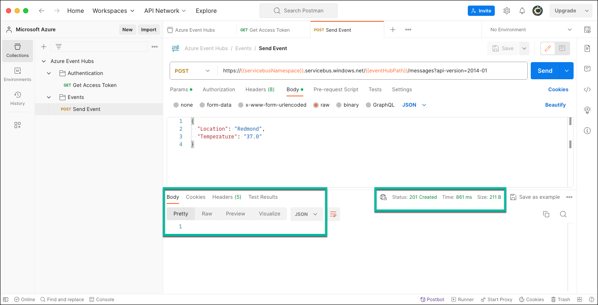
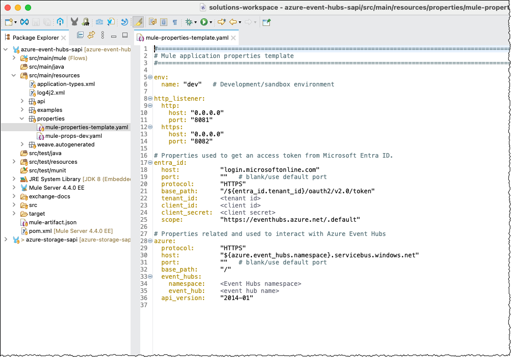

How to Integrate with Azure Event Hubs
======================================

## Table of Contents

- [Introduction](#introduction)
  - [Overview](#overview)
  - [Prerequisites](#prerequisites)
- [Integrate with Azure Event Hubs](#integrate-with-azure-event-hubs)
  - [Part 1 – Configure Azure Resources](#part-1-configure-azure-resources)
    - [1.1 – (Optional) Create a Resource Group](#optional-create-a-resource-group)
    - [1.2 – Configure Azure Event Hubs](#configure-azure-event-hubs)
    - [1.3 – Configure Authentication and Authorization](#configure-authentication-and-authorization)
    - [Authorize Access to Azure Event Hubs](#authorize-access-to-azure-event-hubs)
  - [Part 2 – Review Implementation](#part-2-review-implementation)
    - [2.1 – (Optional) Test Azure Configuration Using Postman](#optional-test-azure-configuration-using-postman)
    - [2.2 – Review Azure Event Hubs SAPI Example](#review-azure-event-hubs-sapi-example)
    - [2.3 – (Optional) Preview Events in Azure Event Hubs](#optional-preview-events-in-azure-event-hubs)
- [Conclusion](#conclusion)
- [Appendix](#appendix)
  - [Error Payload Example](#error-payload-example)
  - [References](#references)
  - [Revision History](#revision-history)


# Introduction

## Overview

Recently, a customer asked us how to publish JSON data to Azure Event Hubs. I authored this guide to capture the essence of the work completed to demo how to integrate Mule with Azure Event Hubs.

## Prerequisites

Before we start, please ensure you have an Azure account and the appropriate privileges to create resources, especially Microsoft Entra ID (formerly known as Azure Active Directory) and Azure Event Hubs resources.

> [!NOTE]
> I authored this content using my personal account and a pay-as-you-go subscription. I cannot confirm if you can create all the required resources using a trial subscription.

# Integrate with Azure Event Hubs

In my experience, building the Mule application to interact with Azure resources such as Azure Storage, Azure Data Lake Storage (Gen2), and Azure Event Hubs is the easy part. The brunt of the work is configuring the different resources in Azure to enable the integration. First, I will guide you through my approach to configuring my Azure account and provisioning all the required resources. Then, I will share and describe a sample system API I built to illustrate how to integrate with Azure Event Hubs.

## Part 1 – Configure Azure Resources

### 1.1 – (Optional) Create a Resource Group

Although this step is optional, I recommend creating a resource group to hold all related resources – e.g., all resources created to support a specific customer demo or proof of concept.

- In the **Microsoft Azure Portal**, click **Create a resource** towards the upper left corner.


- On the **Create a resource** page, enter *resource group* in the search bar.


- In the search results, locate **Resource group** tile, click the **Create** button and the **Resource group** option.


- On the **Basics** tab of the **Create a resource group** page:

  - Enter the name of the resource group, and

  - Optionally, select a different Azure region.


Once done, click the **Next : Tags \>** button.

- On the **Tags** tab of the **Create a resource group** page, add any tags. I typically do not add any, as I leverage the resource group to hold all related resources for a project.


Once done, click the **Next : Review + create \>** button.

- On the **Review + create** tab of the **Create a resource group** page, verify that the validation passed and click the **Create** button.


- Azure creates our resource group immediately. Click **Home** in the breadcrumbs (upper left corner) to return to the Azure Portal home page.


### 1.2 – Configure Azure Event Hubs

When integrating with Azure Event Hubs, there are two essential resources.

1.  The **namespace** provides a unique scoping container in which we create one or more event hubs (1). When creating an Event Hubs namespace, Azure automatically configures a fully qualified domain name (FQDN), enabling us to interact with all the event hubs within the namespace (2). We handle management tasks such as allocating streaming capacity, configuring network security, enabling geo disaster recovery, etc., at the namespace level (3). The namespace also provides a range of access control and network integration management features such as IP filtering, virtual network service endpoint, and Azure Private Link (4).

2.  The **event hub** behaves like a topic in Apache Kafka and is very similar to a topic in the publish-subscribe messaging pattern. As Microsoft described it, an event hub is an append-only distributed log (3). A client application consumes data by seeking through the event log and maintaining an offset (3).

> [!NOTE]
> Conceptually, Azure Event Hubs is similar to Apache Kafka, leading to believe that Microsoft built it on Kafka. However, Microsoft argued that “Azure Event Hubs is a cloud-native multi-tier broker with support for multiple protocols that is developed and maintained by Microsoft and doesn't use any Apache Kafka code” (5).

#### 1.2.1 – Create an Event Hubs Namespace

In this step, we create an Event Hubs namespace mainly using default values (which is appropriate for demoing how to integrate Mule with Azure Event Hubs).

- In the **Microsoft Azure Portal**, click **Create a resource** towards the upper left corner.


- On the **Create a resource** page, enter *event hubs* in the search bar.


- In the search results, locate **Event Hubs** tile, click the **Create** button and the **Event Hubs** option.


- On the **Basics** tab of the **Create Namespace** page:

  - Select a resource group,

  - Enter the name of the namespace,

  - Optionally, select a different **Location**,

  - Select a **Pricing tier**,

  - Optionally, increase the **Throughput Units** option, and

  - Optionally, turn on the **Enable Auto-Inflate** option.


Once done, click the **Next : Advanced \>** button.

- I used the default configuration on the **Advanced** tab.


Once done reviewing these settings, click the **Next : Networking \>** button.

- I also used the default configuration on the **Networking** tab. However, you can optionally select the **Private access** option to secure your Event Hubs namespace and its resources.


Once done reviewing these settings, click the **Next : Tags \>** button.

- Optionally, add any tags on the **Tags** tab. I typically do not add any, as I leverage the resource group (created in step 1.1) to hold all related resources for a given proof of concept or demo.


Once done, click the **Next : Review + create \>** button.

- Verify that the validation succeeded on the **Review + create** tab and click the **Create** button.


- Azure provisions our namespace, which generally takes less than two minutes.


- Wait for the deployment to complete.


Click the **Go to resource** button to open the Event Hubs namespace.

#### 1.2.2 – Create an Event Hub

In this step, we create a single event hub within the namespace we just created and use mainly default values.

- Continuing from the previous step, on the Event Hubs namespace **Overview** page, click on **Event Hubs** within the **Entities** section on the left.


- Click **+ Event Hub** on the **Event Hubs** page.


- On the **Basics** tab of the **Create Event Hub** page:

  - Enter the **Name** of the event hub,

  - Optionally, increase the **Partition count**,

  - Optionally, change the **Cleanup policy**, and

  - Optionally, increase the **Retention time**.


Once done, click the **Next : Capture \>** button.

- Optionally, enable the **Capture** option on the **Capture** tab. Generally, I do not enable this option for my demos.


Once done, click the **Next : Review + create \>** button.

- Verify that the validation succeeded on the **Review + create** tab and click the **Create** button.


- Azure creates our event hub, which generally takes less than two minutes.


- Optionally, wait for the creation to complete.


Click **Home** in the breadcrumbs (upper left corner) to return to the Azure Portal home page.

### 1.3 – Configure Authentication and Authorization

In this step, we configure resources to allow our Mule application to access our Event Hubs namespace and to publish content to our event hub.

### Authorize Access to Azure Event Hubs

In the Azure Event Hubs documentation, Microsoft described two approaches for authorizing access to Azure Event Hubs: a Shared Access Signature (SAS) token and a Microsoft Entra ID token. However, Microsoft recommends using Microsoft Entra ID credentials, when possible, as shared access signatures can be more easily compromised (6). As such, I leveraged Microsoft Entra ID credentials in my demo, and it is the approach documented herein.

#### 1.3.1 – Register an Application

When leveraging Microsoft Entra ID credentials, the first thing to do is register a client application representing our Mule application.

- In the **Microsoft Azure Portal**, click the **Microsoft Entra ID** icon.


- If it is not visible, click the hamburger menu in the top left corner, and select **Microsoft Entra ID**.


- Click **App registrations** on the **Overview** page on the left.


- Click **+ New registration** on the **App registrations** page.


- On the **Register an application page**, enter the name of the client application. I used the name of the Mule application or API for the proof of concept and demo. I also used the default configuration for all other options.


Click the **Register** button once done.

- Azure registers our application (generally) immediately.


- Finally, before proceeding to the next steps:

  - Click the copy icon beside the **Application (client) ID** value and save it for future use. As the name implies, this value represents the client id, which we will use to authenticate our Mule application.

  - Similarly, click the copy icon besides the **Directory (tenant) ID** value and save it for future use. As the name implies, this value represents the tenant id, which is also required to authenticate our Mule application.


Remark: Please do not navigate away from this page, as we will resume from here in the next step.

#### 1.3.2 – Create Client Secret for the Application

Next, we generate a client secret for our application, which is required for authentication.

- Continuing from the previous steps, click **Certificates & secrets** on the left on the **Overview** page of the newly registered application.


- On the **Client secrets** tab, click **+ New client secret**.


- In the right column, optionally enter a general description and optionally change the expiration.


Click the **Add** button once done.

- Azure generates a new client secret. As indicated in the screen capture below, we can only view the Value after its creation. Click the copy icon and save the client secret value safely for future use.


> [!IMPORTANT]
> The Secret ID is a unique identifier and does not represent the client id. More importantly, we do not need the secret id.

Click **Home** in the breadcrumbs (upper left corner) to return to the Azure Portal home page.

#### 1.3.3 – Assign Role to Application on Azure Event Hubs

Finally, we assign a role to our application, allowing it to access our Azure Event Hubs namespace and perform operations on the event hub we created.

- On the **Azure Portal** home page, click the name of your Event Hubs namespace in the **Recent** tab of the **Resources** section.


- Click **Access Control (IAM)** on the left.


- Click the **Add role assignment** button.


- Optionally, enter *event hubs* in the search bar on the **Role** tab and select the role **Azure Event Hubs Data Owner**.

> [!NOTE]
> I use the role **Azure Event Hubs Data Owner** for convenience as it grants full access to my **Azure Event Hubs** resources. Naturally, I could select another role with less privileges and I could also add more role assignments to grant additional access and privileges to other services for example.


Click the **Next** button once done.

- On the **Members** tab, click **+ Select members**.


- On the right column:

  - In the search box, type the name of the client application you registered in the previous steps (e.g., *Azure Event Hubs Contact SAPI*), and

  - Select your client application.


- Once you have selected your client application, click the **Select** button.


- Next, click the **Review + assign** button.


- On the **Review + assign** tab, click the **Review + assign** button again.


- Azure adds the role assignment immediately. Optionally, click the **Role assignments** tab.


- Optionally review all assignments.


Click **Home** in the breadcrumbs (upper left corner) to return to the Azure Portal home page.

## Part 2 – Review Implementation

As discussed in the Introduction section, I built the Mule application to demo how to publish JSON data to Azure Event Hubs. In short, there are two different APIs we need to call to publish data to our event hub:

- First, we authenticate and get an (OAuth 2.0) access token from Microsoft Entra ID.

- Then, we use the access token to call the Azure Event Hubs API to publish data.

When I need to implement a new integration involving APIs and technologies I am not familiar with, I typically start with Postman and use a trial-and-error approach. Using Postman (or even curl) allows me to fine-tune everything more quickly. You can make changes and call APIs in seconds using Postman, whereas you need to rebuild the Mule application before you can test your changes, even if they are minor.

> [!TIP]
> When I need to implement a new integration involving APIs and technologies I am not familiar with, I typically start with Postman (or even curl) and use a trial-and-error approach. Using Postman allows me to fine-tune everything more quickly. You can make changes and call APIs in seconds using Postman, whereas you need to rebuild the Mule application before you can test your changes, even if they are minor.

### 2.1 – (Optional) Test Azure Configuration Using Postman

Although this step is optional, I recommend testing the Azure configuration we just completed using Postman before implementing the Mule application. I published my basic Postman collection to GitHub, which I used to learn and test how to use the Azure APIs to integrate with Azure Event Hubs. You can find it here:
<https://github.com/abelisle-mulesoft/azure-event-hubs-sapi-example/tree/main/postman-collection>

#### 2.1.1 – Update Variables

- In Postman, click the **Azure Event Hubs** collection on the left, and click the **Variables** tab.


- Update the values of the variables **tenantId**, **clientId**, **clientSecret**, **servicebusNamespace**, **eventHubPath**, and **accessToken** with your own values.

  - **servicebusNamespace** represents the name of your Event Hubs namespace, and

  - **eventHubPath** represents the name of your event hub.


#### 2.1.2 – Test Authentication

First, we review the first API request, which we use to authenticate and get an (OAuth 2.0) access token from Microsoft Entra ID. Then, we execute it to test our configuration – e.g., registered client application, client secret.

- In Postman, expand the **Authentication** folder, click the **Get Access Token** request, and click the **Headers** tab.

  - First, review the URI and notice the *{{tenantId}}* variable. Obviously, we are executing this request and authenticating using our tenant id.

  - Second, review the headers and notice that Postman auto-generated all of them. More importantly, I did not add any additional ones.


- Click the **Body** tab and notice the following:


  - Per the screen capture, the mime type is *application/x-www-form-urlencoded*, (obviously dictated by the Microsoft Entra ID API).

  - The body is the second part required to authenticate and get an (OAuth 2.0) access token from Microsoft Entra ID (the first part was the tenant id URI parameter). The key-value pairs include:

  - **client_id**, which represents the client application we registered in step 1.3.1. We also copied its value in step 1.3.1.

  - **client_secret**, which represents the client secret we created in step 1.3.2. Similarly, we copied its value in step 1.3.2.

  - **scope**, which specifies the Azure resource we want to access. We specify the Azure resource as a URI and append */.default* as per Microsoft’s documentation.

  - **grant_type**, which is set to **client_credentials** since we are using a service principal and not a user.

- Once done reviewing, execute this request by clicking the **Send** button.

- Microsoft Entra ID returns an HTTP status of 200 and an access token if our Azure and Postman configurations are valid. More importantly, this request's URI, headers, and body guide the configuration of the associated HTTP request in our Mule application.


> [!NOTE]
> The value of the *expires_in* property is in seconds. Hence, the access token we just received is valid for an hour.

- While here, copy the value of the *access_token* from the response you just got and paste it into the relevant variable in preparation for the next steps.

- Click the **Azure Event Hubs** tab and paste the **access_token** value into the **accessToken** variable.


Postman is now all set to start interacting with Azure Event Hubs, at least until our access token expires.

#### 2.1.3 – Test Publishing an Event

Next, we leverage the access token we pasted in the relevant variable, and we are ready to call the Azure Event Hubs API to publish data. First, we review the request and its configuration and then execute it to test our Azure Event Hubs configuration.

- In Postman, expand the **Events** folder, click the **Send Event** request, and click the **Params** tab.


- First, review the URI and notice the *{{servicebusNamespace}}* and *{{eventHubPath}}* variables. I named my variables the same as per Azure's documentation. (7)


  - *{{servicebusNamespace}}* represents the name of our Event Hubs namespace (e.g., Mule-Event-Hubs-Namespace).

  - *{{eventHubPath}}* represents the name of our event hub (e.g., contact-event-hub).

- Then, notice the *api-version* query parameter, which represents the version of the Azure Event Hubs API.


> [!NOTE]
> The latest version is 2014-01 as documented here: <a href="https://learn.microsoft.com/en-us/rest/api/eventhub/event-hubs-runtime-rest">https://learn.microsoft.com/en-us/rest/api/eventhub/event-hubs-runtime-rest</a>

- Next, click on the **Headers** tab and review the headers.

  - **Authorization** (obviously) represents our (bearer) access token.

  - Postman auto-generated all other headers.


- Now, click on the **Body** tab and review the body.


Naturally, the body represents the data we want to publish to our event hub. As stated before, I demonstrated how to publish JSON data, which is what we see here.

- Finally, execute this request by clicking the **Send** button.



Azure Event Hubs returns an HTTP status of 201 (and no response body) if our Azure and Postman configurations are valid. More importantly, the request's URI parameters, query parameter, headers, and body guide the configuration of the associated HTTP request in our Mule application.

We are now ready to discuss the Mule application.

### 2.2 – Review Azure Event Hubs SAPI Example

I implemented only the critical components in my Studio project for my demo to keep it simple. My API exposes one resource, *events*, and one method, *POST*, and publishes the request body to Azure Event Hubs. I published my Studio project to GitHub and you can find it here:
<https://github.com/abelisle-mulesoft/azure-event-hubs-sapi-example>.

In this section, I assume you cloned or downloaded my Anypoint Studio project from GitHub and imported it into Anypoint Studio. As such, I intentionally do not include XML snippets as I describe the implementation.

- First, I created this project by importing a simplistic API specification to benefit from the scaffolding. You can find the API specification within the project.


- Naturally, I leverage a properties file in YAML format, but I named it to support having an environment specific file – e.g., **mule-props-\<environment\>**.



> [!IMPORTANT]
> As per infosec best practices, I did not commit my development properties file to GitHub as it contains sensitive information. However, I provided a template to enable you to create one specific to your own implementation and Azure resources.

- I leveraged three Mule configuration files as per MuleSoft best practices.


- In the **global.xml** file, notice the following two global configuration elements.

  - First, I defined a global property that specifies the current environment as per best practices.


> [!TIP]
> If you are not familiar with this practice, we typically override this property when deploying our application to higher environments (e.g., test, QA, prod), which results in picking up the properties file specific to that environment.

  - Second, I configured my **Configuration properties** element accordingly.


- In the **azure-event-hubs-sapi.xml** file, notice the error handlers.

  - First, I renamed the **Transform Message** components as I prefer meaningful names.


  - Then, I added a catch all error handler, which is a practice I learned while working on a project reviewed by the Global SE Team.


  - Finally, I use a (more) comprehensive body when returning errors in all my APIs. The JSON “structure” you see here is influenced by API specifications and fragments published in Anypoint Exchange – e.g. accelerators.


> [!NOTE]
> Refer to section [Error Payload Example](#error-payload-example) in the appendix for more information about my default error body.

#### 2.2.1 – Review Flow get-access-token-flow

The **azure-event-hubs-sapi-impl.xml** file includes two flows. The flow *get-access-token-flow*, as its name implies, implements the logic to get an access token from Microsoft Entra ID.


- First, it creates the request body, which is very similar to the one we reviewed in step 2.1.2. Naturally, I leverage properties where practical.


- Then, it calls the Microsoft Entra ID API to get an access token. As implied in the following screen capture, its configuration is inherited from the associated HTTP Request Configuration global element. As reviewed in step 2.1.2, this API does not expect any specific header and query parameter. I arbitrarily included the URI parameter in the base path in the associated HTTP Request Configuration global element.


- Finally, I added the **On Error Propagate** and **Logger** components to log the entire payload Microsoft Entra ID returns when throwing an error. This additional information often (but not always) helps troubleshoot issues.


#### 2.2.2 – Review Flow post-event-impl-flow

In addition, the **azure-event-hubs-sapi-impl.xml** file includes the flow *post-event-impl-flow*, which as its name implies, implements the logic to publish an event to Azure Event Hubs.


- First, it saves the payload, which is the data it publishes to Azure Event Hubs as-is.

- Then, it calls the flow *get-access-token-flow* to authenticate and get an access token from Microsoft Entra ID.

- Finally, it calls the Azure Event Hubs API to publish the data to our event hub.


- As reviewed in step 2.1.3, this API requires the header *authentication*.


- It requires the query parameter *api-version*.


- I arbitrarily included the URI parameter *namespace* in the base path and the *event hub name* in the path.


- Similarly, I added the **On Error Propagate** and **Logger** components to log the entire payload the Azure APIs return when throwing an error. This additional information often (but not always) helps troubleshoot issues.


### 2.3 – (Optional) Preview Events in Azure Event Hubs

As part of my demo to the customer, I leverage a built-in capability to preview and show the events I published to Azure Event Hubs. This section describes how I did that.

- First, log in to the Azure Portal.

- On the **Azure Portal** home page, click the name of your Event Hubs namespace in the **Recent** tab of the **Resources** section.


- On the namespace **Overview** page, click on **Event Hubs** within the **Entities** section on the left.


- On the **Event Hubs** page, click on the name of the event hub you created in step 1.2.2.


- On the **Overview** page, click the **Process data** tile, or click on **Process data** within the **Features** section on the left.


- On the **Process data** page, scroll down and locate the tile **Enable real time insights from events**, and click the **Start** button.


- On the next page, Azure automatically runs a query to retrieve sample events from our event hub. It usually can take up to a few minutes before it shows the events.


The screen capture shows/previews four different events. Please remember that you cannot delete events from your hub. However, the default retention time is 1 hour, which means Azure Event Hubs will automatically remove events after 1 hour.

# Appendix

## Error Payload Example

As stated and illustrated in section **2.2 – Review Azure Event Hubs SAPI Example**, I use a (more) comprehensive body when returning errors in all my APIs. Following is an example of the payload returned when an error occurs.

```json
{
  "dateTime": "2023-01-01T08:00:00.000-08:00",
  "httpStatus": "500",
  "errorMessage": "Operation failed (see responseDetails for more information)",
  "errorType": "VALIDATION_FAILED",
  "responseStatus": "ERROR",
  "responseDetails": [
    {
      "severity": "ERROR",
      "code": "EFBIG",
      "message": "An abnormal condition occurred"
    }
  ]
}
```

Following is more information about the properties.

| **Property**     | **Required?** | **Description**                                                                                                                                                                                                                              |
|------------------|---------------|----------------------------------------------------------------------------------------------------------------------------------------------------------------------------------------------------------------------------------------------|
| dateTime:        | Y             | Date and time we are reporting the error (i.e., Dataweave function now()).                                                                                                                                                                   |
| httpStatus:      | Y             | HTTP status code of the response.                                                                                                                                                                                                            |
| errorMessage:    | Y             | Summary message.                                                                                                                                                                                                                             |
| errorType:       | Y             | Error type.                                                                                                                                                                                                                                  |
| responseStatus:  | N             | Optional property that indicates the overall status of the operation (e.g., SUCCESS, WARNING, ERROR).                                                                                                                                        |
| responseDetails: | N             | Optional array, which is a structure for providing additional details to a response returned by an API.                                                                                                                                      |
| severity:        | N             | Indicates the severity of this responseDetails.message (i.e., INFO, WARNING, ERROR).                                                                                                                                                         |
| code:            | N             | Represents an optional alphanumeric code that uniquely identifies this message. We included this property to support cataloging messages and provide additional information such as comprehensive descriptions, mitigation, workaround, etc. |
| message:         | N             | Represents the short text or description of this responseDetails.message.                                                                                                                                                                    |

## References

- 1 - <https://learn.microsoft.com/en-us/azure/event-hubs/event-hubs-create>
- 2 - <https://learn.microsoft.com/en-us/azure/event-hubs/event-hubs-faq>
- 3 - <https://learn.microsoft.com/en-us/azure/event-hubs/event-hubs-about>
- 4 - <https://learn.microsoft.com/en-us/azure/event-hubs/event-hubs-features>
- 5 - <https://learn.microsoft.com/en-us/azure/event-hubs/apache-kafka-frequently-asked-questions>
- 6 - <https://learn.microsoft.com/en-us/azure/event-hubs/authenticate-shared-access-signature>
- 7 - <https://learn.microsoft.com/en-us/rest/api/eventhub/send-event>

